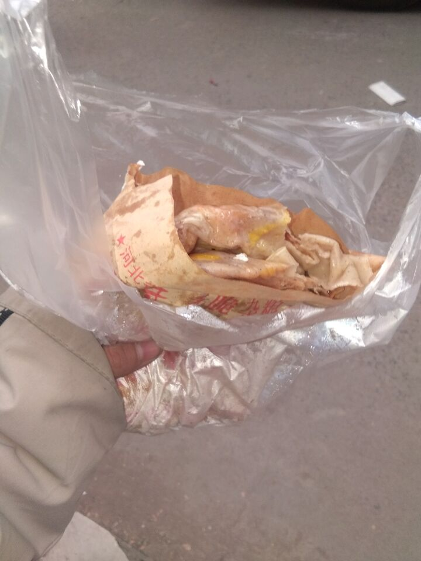

## 民嘲讽尧的网站

你永远不知道我是怎么做到的，因为你很无知，啊哈哈哈哈哈哈哈哈哈哈哈哈哈哈哈哈哈哈哈哈哈哈哈哈哈哈哈哈哈哈哈！！

这个网站是专门为了民民嘲讽尧尧而设定的，在这里民民是无敌的，民民可以把尧尧的丑东西放在这里。

Whenever you commit to this repository, GitHub Pages will run [Jekyll](https://jekyllrb.com/) to rebuild the pages in your site, from the content in your Markdown files.

### 可怜的尧

尧已经流浪街头，每天只能吃上煎饼。


```markdown
Syntax highlighted code block

# Header 1
## Header 2
### Header 3

- Bulleted
- List

1. Numbered
2. List

**Bold** and _Italic_ and `Code` text

[Link](url) and 
```

For more details see [GitHub Flavored Markdown](https://guides.github.com/features/mastering-markdown/).

### Jekyll Themes

Your Pages site will use the layout and styles from the Jekyll theme you have selected in your [repository settings](https://github.com/sds202/SDS202-s-Blog/settings). The name of this theme is saved in the Jekyll `_config.yml` configuration file.

### Support or Contact

不要再往下翻了，我刚做好里面啥还没有类
